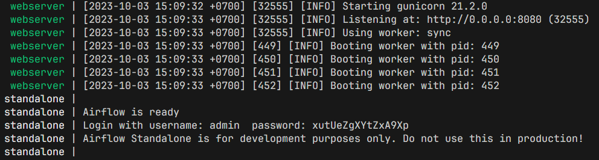
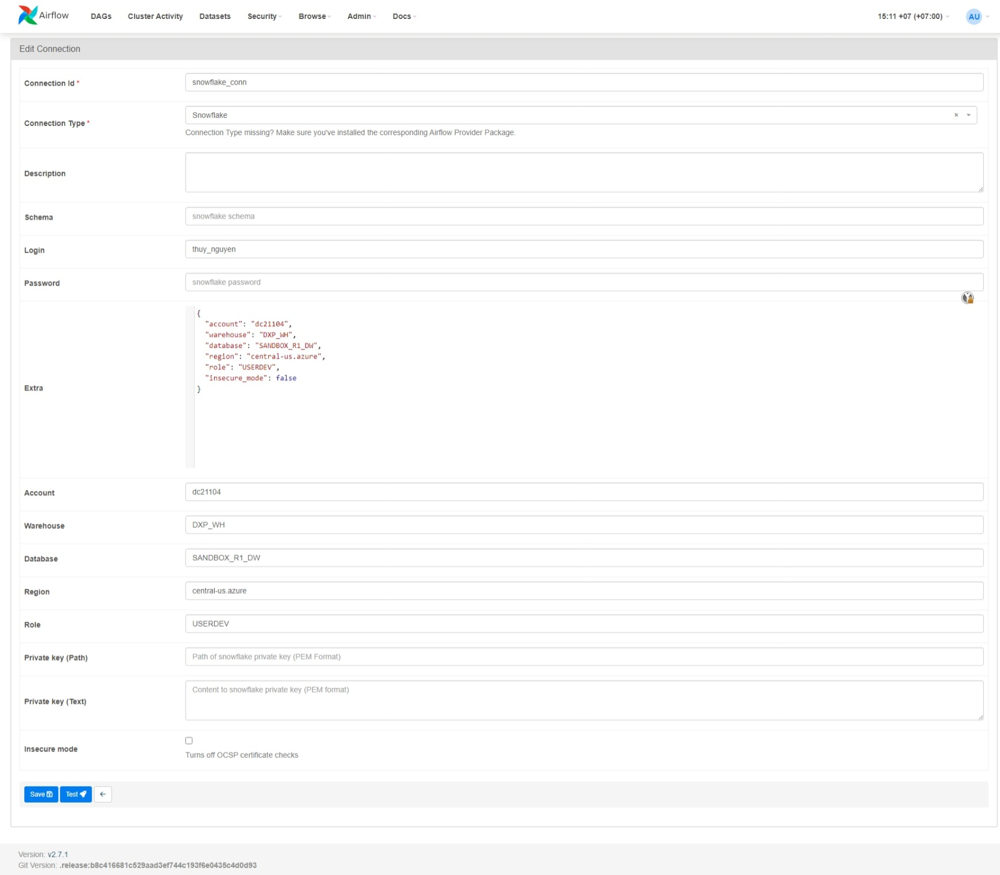
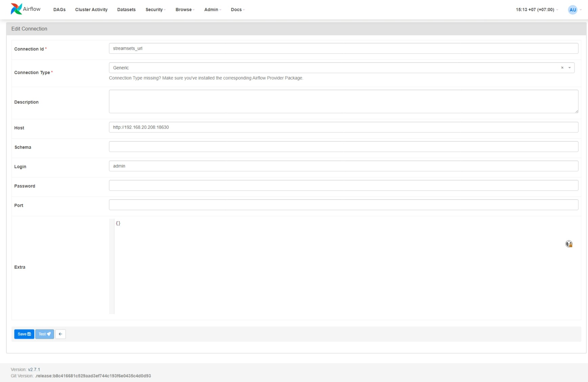

# For local development

```
Please use a UNIX machine or WSL. Windows is not supported.
```

## Clone project

```bash
git clone DXP-Airflow
cd DXP-Airflow
```

## Create virtual environment

```bash
python -m venv .venv

# Assummming that you have installed VS Code
code .
```

## Set `AIRFLOW_HOME` to local dir

Airflow uses static `AIRFLOW_HOME` to get the location all files (libraries, dags, configs, ...).
Point `AIRFLOW_HOME` to your directory.

```bash
export AIRFLOW_HOME=$(pwd)/airflow >> ~/.bashrc
```

---

## Install libraries

```bash
pip install -r requirements.txt
```


## Run PostgreSQL as local DB

```bash
docker compose -f docker-compose.demo.yaml up -d
```

## Start server

```bash
airflow standalone
```

Read the log, an account `admin` and password will be printed out.
Go to [http://localhost:8080](http://localhost:8080) and use that credential to enter Airflow Webpage.



# Add connections

Go to **Admin > Connections** to manage connection.

## Snowflake


## StreamSets


## ADF
ADF connection is quite difficult. Contact Thuy Nguyen for more details.