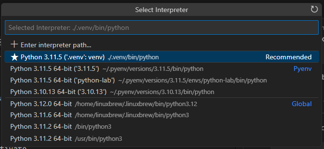
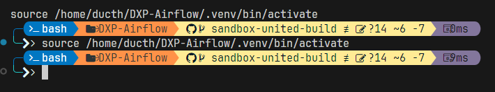

# Python and Virtual Environment

## Background
When installing a package using `pip`, Python by default used the current available **interpreter**.

```shell
> pip list

Package    Version
---------- -------
pip        23.0.1
setuptools 65.5.0
```

(Interpreter is the program the execute a script)

For small project, this is a **good enough** 😅. However, for some cases, we may need seperation between our projects:
- Conflicting package versions (`2.1.0` vs `1.9.1`)
- A disposable environment (for quickly delete and recreate from scratch)

Pyenv supports this feature. But, I want to describe one alternative solution: using [Python `venv`](https://docs.python.org/3/library/venv.html)

*(During this doc, I will use venv to short for virtual environment)*


## Create a venv
In a Python project, execute:
```shell
> python -m venv .venv

> ls
...
drwxr-xr-x  7 ducth ducth  4096 Nov 15 16:04 .venv
...
```

A directory will be created to store our venv.

## Activate a venv
To activate our created venv, at the same directory, use:
```shell
> source ./.venv/bin/activate

# Your shell may be changed to notified that you are using a venv
(.venv) >
```


If you install new packages in this package in this venv, it won't affect other venvs.

```shell
# Black is a formatter tool
(.venv) > pip install black
...

# Deactivate, stop using venv
(.venv) > deactivate

> pip list
# Black will not be displayed here, as it has not been installed at the top level environment
```

## Working with VS Code
We can make VS Code use our venv by:
1. Open the directory in VS Code
2. `Ctrl + Shift + P` > **Python: Select Interpreter** > Choose the interpreter located in our venv folder (`.venv/bin/python`)



Now, every time you open a shell in VS Code, the venv will be activated.



## Delete venv
Simply delete the directory (`.venv`).