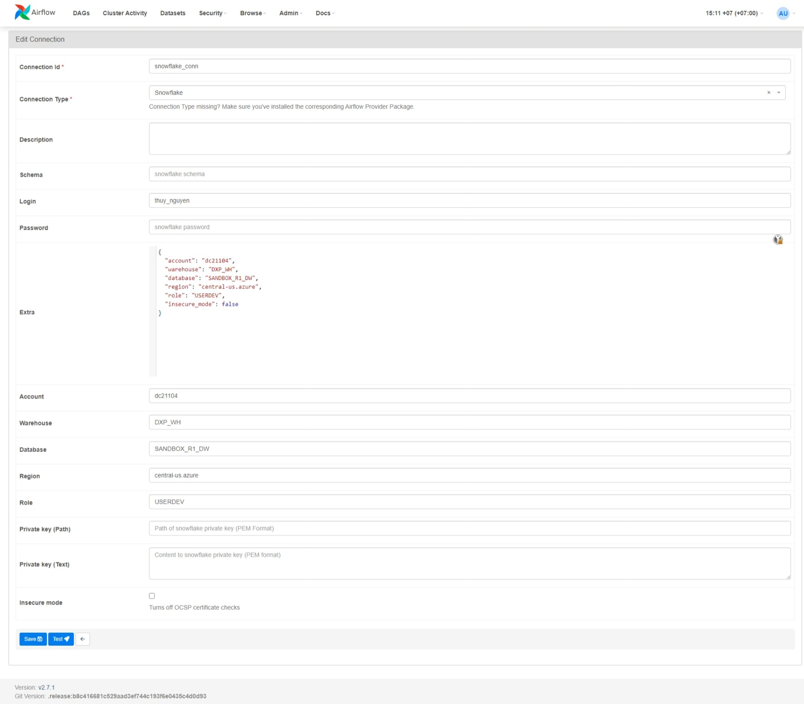
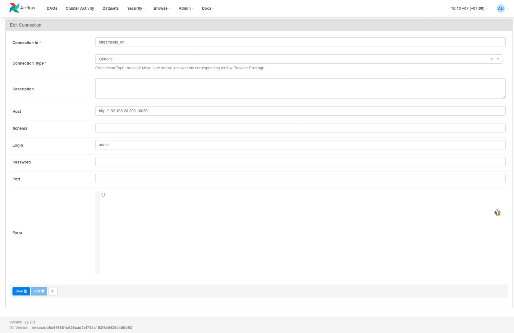

# Setup local development

```
Please use a UNIX machine or WSL. Windows is not supported.
```

## Prerequisite:

1. Using Python 3.10 or higher (see [Setup Pyenv](0000_Pyenv_and_Python_env.md)) if you wish to change your existing Python version.
2. (Optional) For jobs using `SparkSqlToElasticsearch` and `SparkSqlToSql`, make sure you have also installed Java 11 or higher, and config `JAVA_HOME` correctly. ([Learn more about Java](0002_Java.md))
3. Install VS Code (or Pycharm if you feel confident)

## Step 1: Clone project
```bash
> git clone git@github.com:thuynguyen-storai/DXP-Airflow.git
> cd DXP-Airflow

# Open project in VS Code
> code .
```

## (Optional) Step 2: Create virtual environment
Visit [Python Virtual Environment documentation](0001_Python_virtualenv.md) if you wish to use venv


## Step 3: Set `AIRFLOW_HOME` to local dir

Airflow uses static `AIRFLOW_HOME` to get the location all files (libraries, dags, configs, ...).
Please point `AIRFLOW_HOME` to your directory.

```bash
# For Bash users
> export AIRFLOW_HOME=$(pwd)/airflow >> ~/.bashrc

# For Zsh users
> export AIRFLOW_HOME=$(pwd)/airflow >> ~/.zshrc
```


## Step 4: Install libraries
For local development, we also need to install the `requirements_dev.txt` file, which contains tools for [linting](https://en.wikipedia.org/wiki/Lint_(software)), [formatting](https://nono.ma/linter-vs-formatter), etc...
```bash
> pip install -r requirements.txt -r requirements_dev.txt
```


<!-- 
## Run PostgreSQL as local DB

```bash
docker compose -f docker-compose.demo.yaml up -d
```

## Start server

```bash
airflow standalone
```

Read the log, an account `admin` and password will be printed out.
Go to [http://localhost:8080](http://localhost:8080) and use that credential to enter Airflow Webpage.


# Add connections

Go to **Admin > Connections** to manage connection.

## Snowflake


## StreamSets


## ADF
ADF connection is quite difficult. Contact Thuy Nguyen for more details. -->