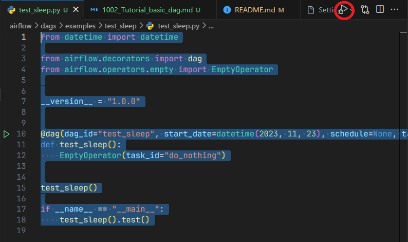

# Tutorial: An example dag

To support our project, I have split our repo into 2 main directories:

1. `airflow/`: contains all the DAGs
2. `rs_airflow/`: is the library of customized Operators, Hooks, etc, ...

For now, you should only care about the `airflow/` directory.

## Create an example DAG

Inside `airflow/dags/examples`, create a directory of name `test_empty`. Then inside it, create a Python file with the same name:

```python
# airflow/dags/examples/test_empty/test_empty.py

from datetime import datetime

from airflow.decorators import dag
from airflow.operators.empty import EmptyOperator


__version__ = "1.0.0"


@dag(dag_id="test_sleep", start_date=datetime(2023, 11, 23), schedule=None, tags=[__version__])
def test_sleep():
    EmptyOperator(task_id="do_nothing")


test_sleep()

if __name__ == "__main__":
    test_sleep().test()
```

The content of that file should be as above:

## DAG syntax

To create a dag, use the `@dag` to mark a method as a DAG. Make sure that:

1. `dag_id` is unique (and should be the same as your file name).
2. `start_date` is the DAG created date. It should only be set once, and must not use `datetime.now()`.
3. `tags` should have a `__version__` var for basic versioning of DAG.

## Create a task

DAG are composed of Tasks,, and Operators are just Tasks.

For now, we use a simple `EmptyOperator` as an example. Every task, operator must have a `task_id`.

## Other details

The above line is used to initiate our DAG

```python
test_sleep()
```

The last lines are used for local debugging

```python
if __name__ == "__main__":
    test_sleep().test()
```

## Run DAG locally

In VS Code, press the **Debug button** to start running locally.


