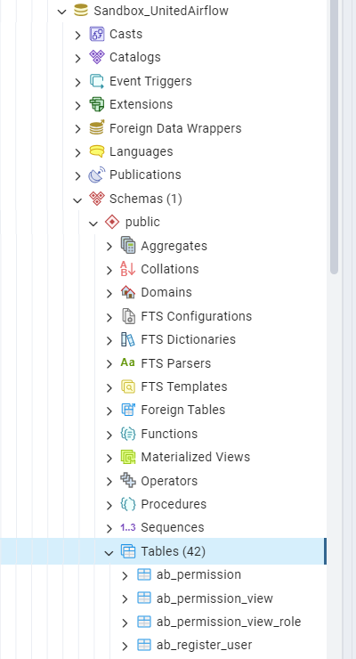

# Setup Kubernetes - steps by steps

Assuming that Kubernetes has been setup:

## Note

Every GitHub repository, Docker image and machine is for testing environment. One should modify it to match the convention.

## Step 1: Create a dedicated PostgreSQL database

Each instance of Airflow requires a dedicated database for storing its data.
This doc assumes that a Postgres user - password of `sandbox_united_airflow` - `password` and connect to a database name `Sandbox_UnitedAirflow`



## Step 2: Checkout and build Docker image

This can be setup using Jenkins:

```shell
> git clone https://github.com/Mcmtechnologies/DXP-DataPipeline
> git checkout sandbox-united-build

# Example of Docker build, DevOps should modify this
> docker build -t ducthuyng/test-airflow-rs-image:0.2.9 -t ducthuyng/test-airflow-rs-image .
> docker push ducthuyng/test-airflow-rs-image:0.2.9
```

## Step 3: Choosing logs location

For now, we choose to use Azure Blob Storage for storing DAG logs (with a predefined retention period).
Logging using PVC is possible, but needs some reconfigurations.

## Step 4: Modify values for Helm chart

Before moving on, you should spend sometimes reviewing Airflow's Helm charts and values for some background details.

In this repo, an example YAML values for Helm: 
Some of the details that you should take some considerations:

1. `data.metadataConnection` should point to our PostgreSQL
2. `images.airflow` should use the correct images
3. For first time run, `migrateDatabaseJob.enabled: true` can be used to help running database migrations.
  For consecutive runs, we can mark it as false.
4. `webserver.service` may need to modify for exporting ports

## Step 5: Update Helm Chart

Install Airflow Helm repository (for first run).

```shell
helm repo add apache-airflow https://airflow.apache.org
```

Then, use the below command to update Airflow deployment.

```shell
helm upgrade --install airflow apache-airflow/airflow --values ./k8s/UatLeever.values.yaml
```

## Extra 1: Perform Airflow database migration on a local machine
Instead of running migration every time, we can run once a a local machine:
1. Visit [1001_Setup_local_development.md](1001_Setup_local_development.md) for guide on how to install Airflow locally
2. Run `airflow db migrate` to perform migration.
